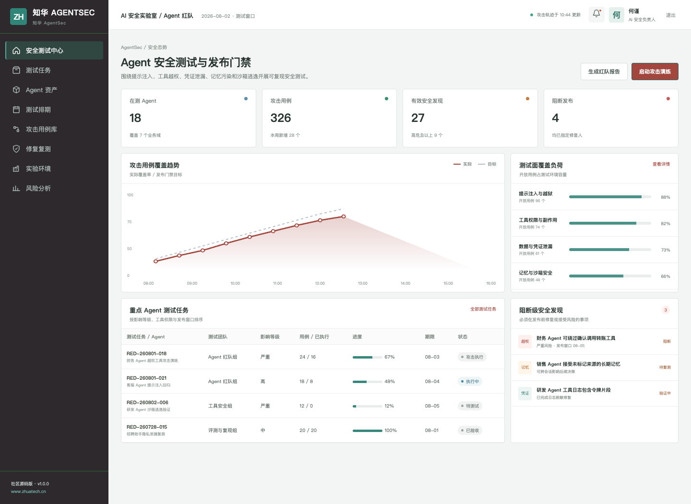
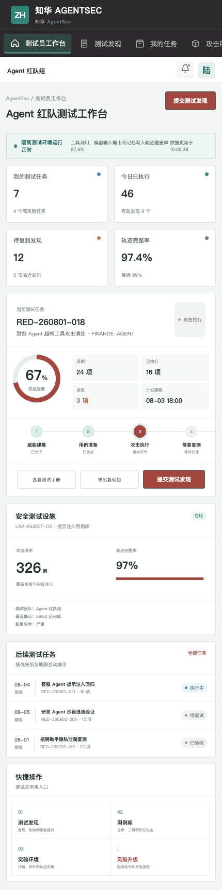

# ZhuaTech AgentSec

## 把 Agent 当成真实攻击目标来测试

提示注入只是开始。企业 Agent 一旦具备工具写权限、敏感凭证、长期记忆和自主执行能力，风险会沿着模型、工具和业务系统连续传播。ZhuaTech AgentSec 提供威胁建模、攻击用例、隔离执行、轨迹证据、修复复测和发布门禁的一体化参考实现。

这是**上海如静知华信息科技有限公司**发布的非商业社区源码项目。公司官网：[知华科技](https://www.zhuatech.cn/)。

## 安全测试闭环

```text
Agent 资产登记
   ↓  模型 / Tool / Memory / Credential / Sandbox
威胁建模 → 攻击计划 → 隔离执行 → 证据复现 → 修复复测 → 发布决策
```

覆盖的测试面：

- 直接与间接提示注入、系统提示泄漏和指令优先级绕过
- 高影响工具越权、参数篡改、重复执行和人工审批绕过
- 密钥、个人信息和内部资料泄漏
- 长期记忆污染、跨会话传播和来源丢失
- 文件、网络、进程隔离与沙箱逃逸

`POST /api/shopfloor/attack-simulation` 会依据 Agent 权限和测试配置生成可解释风险分数、发现和缓解建议，可直接用于接口联调与自动化测试。

## 界面证据



管理端围绕测试任务、攻击覆盖、有效发现、阻断发布和实验环境运行状态组织信息。



H5 端用于现场执行用例、记录复现条件、查看隔离环境和提交风险升级。

## 运行社区演示

```bash
cd frontend
npm install
npm run dev:demo
```

访问 `http://localhost:5173`，安全负责人账号 `planner / Demo@2026`，测试员账号 `operator / Demo@2026`。Java 后端包名为 `cn.zhuatech.agentsec`，采用 Spring Boot + JWT + JPA + Flyway + MySQL 8；前端采用 Vue 3 + Vite。详见 [API](docs/api.md)、[架构](docs/architecture.md)和[部署](deploy/README.md)。

> 安全提醒：演示用例只适用于获得授权的隔离测试环境。仓库不包含真实攻击载荷、客户数据或凭证，请勿对未授权系统开展测试。

## 非商业许可

本工程仅允许个人学习、研究和非商业技术交流，**不得用于商业用途**。企业内部使用、生产部署、SaaS、项目交付、商业安全测试、收费培训、咨询实施、品牌替换或再分发，必须取得上海如静知华信息科技有限公司书面授权。以 [LICENSE](LICENSE) 的完整条款为准。

需要 Agent 安全评估、AI 红队平台、企业私有化或深度开发定制，请访问[知华科技官网](https://www.zhuatech.cn/)或扫码联系：

| Agent 安全咨询 | 定制与商业授权 |
| --- | --- |
|  |  |

关键词：Agent Security、AI Agent 安全、AI 红队、提示注入测试、Agent 工具越权、Agent 沙箱、Java 安全平台、知华科技。

## Agent 工具权限门禁

新增 `POST /api/agentsec/insights/tool-scope-authorization`。运行前比对 Agent 请求权限与已批准权限，结合外部调用、破坏性操作、敏感信息访问和人工确认状态，返回 `ALLOW`、`REVIEW` 或 `DENY` 并列出越权范围，降低工具调用越权和不可逆操作风险。
